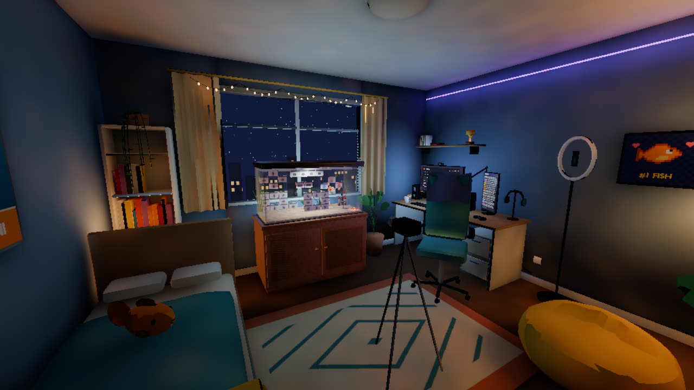
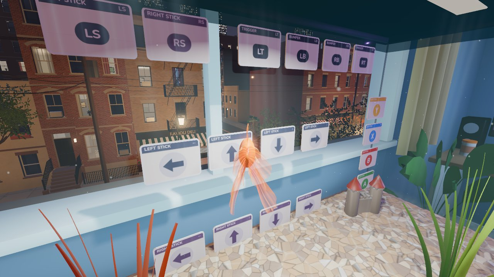
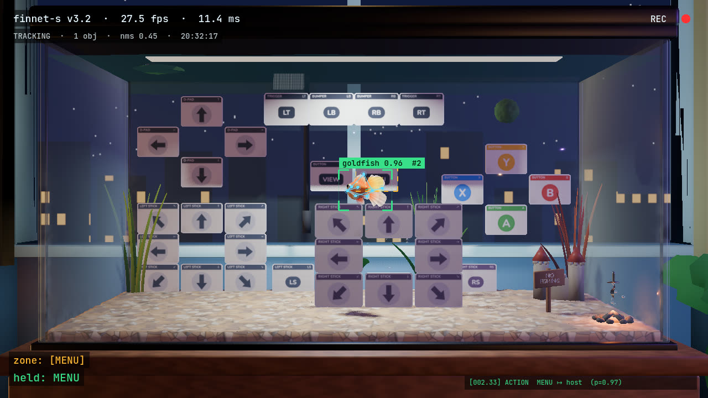

# Linguini

Fish can do anything.

Linguini lets you play your PC games as a goldfish. Swimming in front of a flash card in your tank presses that button in the game, which plays on a monitor across the room. Any game your PC can stream over [Moonlight](https://moonlight-stream.org/) works, from either [Sunshine](https://github.com/LizardByte/Sunshine) or GeForce Experience, though you will need to install Linguini on a separate machine from your game host.

Inspired by Tortellini, the fish who conquered Elden Ring.

*Your view while you play.*

*The tank cam opens as its own window, so you can add it to your stream in OBS.*

Controls, building from source and everything else are in [docs/guide.md](docs/guide.md).

## License

Linguini is licensed under the [GNU General Public License v3.0](LICENSE). It builds in moonlight-common-c and moonlight-embedded, which are GPLv3 as well.
